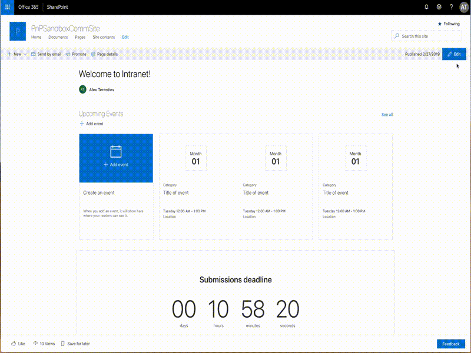

# Page Sections Navigation

Sample web parts allowing to add sections navigation to the SharePoint page.

## Used SharePoint Framework Version 

## Applies to

* [SharePoint Framework](http://dev.office.com/sharepoint/docs/spfx/sharepoint-framework-overview)
* [Office 365 developer tenant](http://dev.office.com/sharepoint/docs/spfx/set-up-your-developer-tenant)

## Solution

Solution|Author(s)
--------|---------
page-sections-navigation|Alex Terentiev (MVP, [Sharepointalist Inc.](http://www.sharepointalist.com), [AJIXuMuK](https://github.com/AJIXuMuK), [@alexaterentiev](https://twitter.com/alexaterentiev))

## Version history

Version|Date|Comments
-------|----|--------
1.0|February 27, 2019|Initial release

## Disclaimer
**THIS CODE IS PROVIDED *AS IS* WITHOUT WARRANTY OF ANY KIND, EITHER EXPRESS OR IMPLIED, INCLUDING ANY IMPLIED WARRANTIES OF FITNESS FOR A PARTICULAR PURPOSE, MERCHANTABILITY, OR NON-INFRINGEMENT.**

---

## Minimal Path to Awesome

* clone this repo
* move to right folder
* in the command line run:
  * `npm install`
  * `gulp bundle --ship`
  * `gulp package-solution --ship`
* from the _sharepoint/solution_ folder, deploy the .sppkg file to the App catalog in your tenant
* in the site where you want to test this solution
  * add the app named _page-sections-navigation-client-side-solution_
  * edit a page
  * add _Page Sections Navigation_ web part
  * add as much _Page Sections Navigation Anchor_ web parts as you want - each anchor adds an item to the navigation
  * configure web parts

## Features

This sample illustrates how to use SharePoint Framework Dynamic Data features to connect web parts on the page.
It also can be used as ready-to-go solution to add page sections navigation to SharePoint pages.